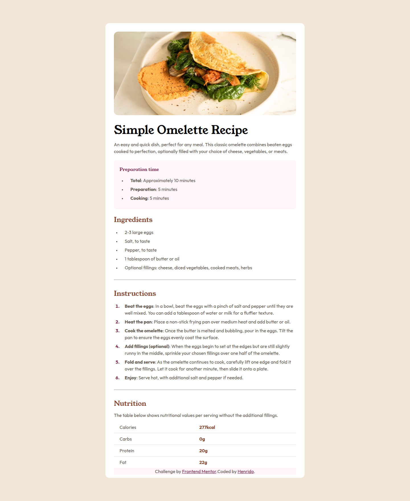

# Frontend Mentor - Recipe page solution

This is a solution to the [Recipe page challenge on Frontend Mentor](https://www.frontendmentor.io/challenges/recipe-page-KiTsR8QQKm). Frontend Mentor challenges help you improve your coding skills by building realistic projects. 

## Table of contents

- [Overview](#overview)
  - [The challenge](#the-challenge)
  - [Screenshot](#screenshot)
  - [Links](#links)
- [My process](#my-process)
  - [Built with](#built-with)
  - [What I learned](#what-i-learned)
  - [Continued development](#continued-development)
- [Author](#author)

## Overview

My solution to recipe-page challenge from Frontend Mentor.

### Screenshot

### Links

- Solution URL: [My solution](https://your-solution-url.com)
- Live Site URL: [Live site](https://henrido-cpu.github.io/recipe-page/)

## My process

Step 1: Analyze design picture and think of a plan about what structure to use with HTML and CSS. I ended up with wrapping blocks of content into block level elements like sections, header or footers. Semantic HTML was my goal here. With CSS i ended up using flexbox.

Step 2: Build HTML and wrap the elements in need of a container to their own containers for easier layouting with flexbox. 

Step 3: Once HTML is done and appropriate classes have been added for elements in need. Start styling with CSS using flexbox.

Step 4: Start from top to bottom styling one section at a time.

Step 5: Once all section complete, start focusing on details, such as font sizes, colors and list markers.

Step 6: 
That's all, page build Complete!

### Built with

- Semantic HTML5 markup
- CSS custom properties
- Flexbox

### What I learned

I learned to use Semantic HTML in this project. I didn't have much experience with Semantic HTML markup but i decided to push myself to use as much as possible of semantic HTML in this project and i am happy that i did.

### Continued development

On my next projects, i want to start focusing more on aria attributes for accessibility.

## Author

- Instagram - [@henridoweb](https://www.instagram.com/henridoweb/)
- Frontend Mentor - [@Henrido-cpu](https://www.frontendmentor.io/profile/Henrido-cpu)
- X - [@HenridoWeb](https://x.com/HenridoWeb)